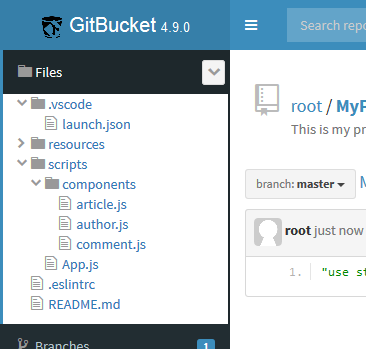

gitbucket-explorer-plugin  
===

This plugin provides an explorer like file tree for GIT repositories with [GitBucket](https://github.com/gitbucket/gitbucket).

Version
---

Plugin version|GitBucket version
:-------------|:----------------
9.0.x         |4.35+
8.0.x         |4.34+
7.0.x         |4.32+
6.1.x         |4.26+
6.0.x         |4.23+
5.0.x         |4.21+
4.0.x         |4.16+
3.0.x         |4.11+
2.0.0         |4.10+
1.0.x         |4.9.x

Download
---

You can download the JAR file from the [Release](https://github.com/tomoki1207/gitbucket-explorer-plugin/releases) page.

Installation
---

Copy the downloaded plug-in JAR file to your `GITBUCKET_HOME/plugins` directory, and then restart the GitBucket instance.

Building
---
Pre-requisites are Node, NPM, SBT, and Java 8.
- Run `npm install` to install all node dependencies.
- Run `npm run-script release` to create a **complete** release (this will call SBT too).

See `package.json` for more details.

Releases
---
### 9.0.0 - 29 Dec 2020
- Bump to GitBucket 4.35.0

### 8.0.0 - 8 Aug 2020
- Bump to GitBucket 4.34.0

### 7.0.0 - 7 Aug 2019
- Bump to GitBucket 4.32.0 and Scala 2.13.0

### 6.1.0 - 1 Jul 2018
- Bump sbt-gitbucket-plugin to 1.3.0 to be hosted by the [plugin registry](https://plugins.gitbucket-community.org/)

### 6.0.0 - 23 Apr 2018
- Bump to GitBucket 4.23.1

### 5.0.0 - 29 Jan 2018
- Bump to GitBucket 4.21.2

### 4.0.0 - 5 Sept 2017
- Bump to GitBucket 4.16

### 3.0.0 - 7 Apr 2017

- Bump to GitBucket 4.11

### 2.0.0 - 28 Feb 2017

- Bump to GitBucket 4.10

### 1.0.2 - 16 Feb 2017

- (bugfix) No redirect to css on deny anonymous access

### 1.0.2 - 15 Feb 2017

- Fixed some bugs

### 1.0.1 - 8 Feb 2017

- Display tree of selected branch

### 1.0.0 - 6 Feb 2017

- first release

Credits
---

This plug-in was developed by [@tomoki1207](https://github.com/tomoki1207).
